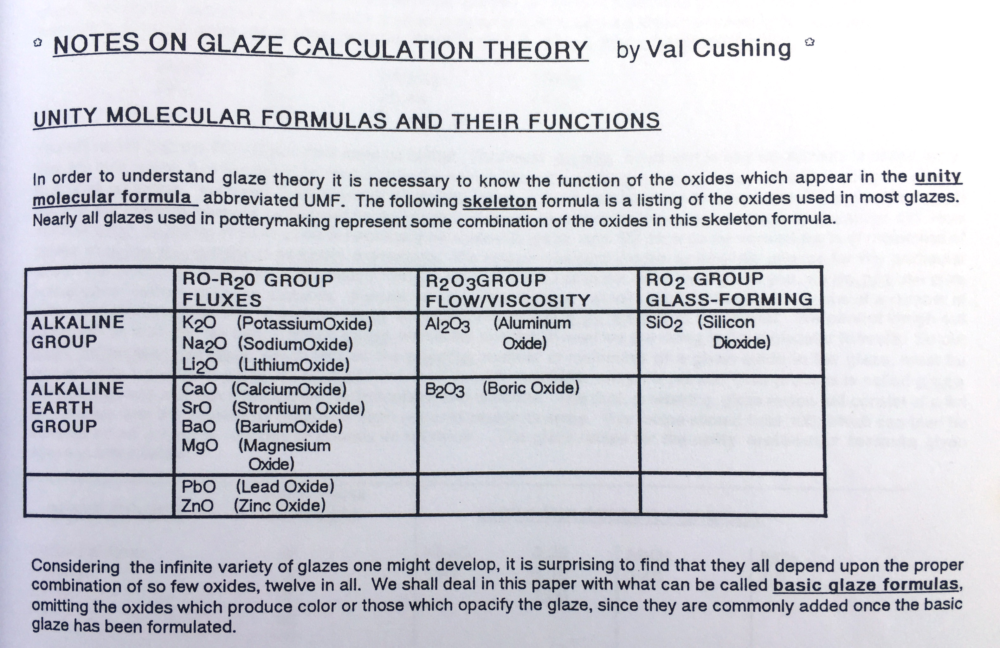

# Unity Molecular Formula (UMF)

The Unity Molecular Formula, also known as _UMF_ or _Seger Formula_, is a method used in ceramics that represents glaze components in terms of the number of molecules, normalizing the total flux oxides to unity (1.0). This normalization process allows for easy comparison of different glaze recipes, as it reveals the ratio between fluxes as well as the relationship between combined fluxes and other glaze components. Oxides are grouped into categories such as RO/R2O (flux), R2O3 (stabilizers), and RO2 (glassformers). By unifying the fluxes, we can compare the amounts of stabilizers, glass-formers, and other oxides, allowing for a more informed understanding of the glaze's chemistry.

::: tip Unity
"Unifying" refers to the process of adjusting the quantities of specific components in a formula so that they total to a standard value, typically one (i.e., "Unity"). This standardization allows for easier understanding and comparison of relationships within various chemical compositions, such as glazes in ceramics, by presenting them on a common scale.
:::

UMF is a useful tool for comparing one glaze with another, evaluating glaze recipes, calculating material substitutions, and revising melting points. Although there are some criticisms regarding its precision and limitations with certain oxides like boron, as well as debate over how oxides should be grouped, the Unity Molecular Formula continues to be a useful tool for offering an abstract yet informative view of glaze chemistry based on the relative numbers of each molecular component.

Put in another way by Linda Arbuckle:

> Silica is a glass former. Alumina modifies a glass. Fluxes reduce melting temperature. The Unity Molecular Formula (UMF) systematically relates these chemistries to each other in a useful glaze chemistry shorthand UMF shows the ratio of glass formers to fluxes and can be used to predict glaze behavior.

## Flux Groups: Alkali Metals & Alkaline Earth Metals

In ceramic chemistry, the fluxes are substances that lower the melting point of a glaze, allowing it to mature and form a glassy surface at a specific firing temperature. These fluxes are generally categorized into two groups: alkali metals (R2O) and alkaline earths (RO).

**Alkali Metals (R2O)** are typically the oxides of Group 1 elements in the periodic table, such as sodium (Na2O), potassium (K2O), and lithium (Li2O). Feldspars as well as carbonates (like Lithium carbonate) are often used to source these oxides. Alkalis are highly reactive and powerful fluxing agents that tend to melt and flow more readily. They can also modify the color or surface qualities of the glaze.

**Alkaline Earth Metals (RO)** typically consist of oxides from Group 2 elements like calcium (CaO), magnesium (MgO), and barium (BaO). These fluxes are generally less powerful or reactive than the alkali metals, and they're often referred to as "secondary" fluxes. They contribute to the hardness and durability of the glaze but usually melt at somewhat higher temperatures. They can also impact the color and texture of the glaze but in a more controlled and stable way.

The balance between these two groups of fluxes in a glaze recipe can significantly impact the characteristics of the finished product. The choice and proportion of alkalis and alkaline earth fluxes allow us to control the glaze's melting behavior, stability, appearance, and other properties. By understanding these two categories and how they interact, we can design glazes that achieve specific effects, textures, and colors, suitable for different ceramic applications.

## UMF Example

Imagine we have the following two recipes:

- Recipe 1: Potash Feldspar 40, Silica 30, Whiting 20, Kaolin 10
- Recipe 2: Soda Feldspar 36.4, Wollastonite 23.2, Silica 18, Grolleg Kaolin 11.6

These recipe's percent analyses might look quite different:

|          | SiO2  | Al2O3 | Na2O | K2O  | CaO   | LOI   |
| -------- | ----- | ----- | ---- | ---- | ----- | ----- |
| Recipe 1 | 60.6% | 11.3% | -    | 6.8% | 11.2% | 10.0% |
| Recipe 2 | 67.9% | 12.7% | 4.8% | 0.2% | 12.6% | 1.6%  |

But in UMF, we can see that these recipes are almost exactly the same, and they should be similar when fired:

Recipe 1 UMF

| R2O/RO (Fluxes) | R2O3 (Stabilizers) | RO2 (Glass-formers) |
| --------------- | ------------------ | ------------------- |
| 0.26 K2O        | 0.41 Al2O3         | 3.71 SiO2           |
| 0.74 CaO        |                    |

Recipe 2 UMF

| R2O/RO (Fluxes) | R2O3 (Stabilizers) | RO2 (Glass-formers) |
| --------------- | ------------------ | ------------------- |
| 0.26 Na2O       | 0.41 Al2O3         | 3.71 SiO2           |
| 0.74 CaO        |                    |

Note that in the above UMF analyses, the sum of the fluxes always adds up to 1.

## "Traditional" and "Extended" UMF in Glazy

There are two versions of the UMF on Glazy. The first is _traditional UMF_, which is the way most people (and glaze calculation software) have historically calculated UMF. The second version is _Extended UMF_, which includes additional oxides into the unity flux calculation.

### Traditional UMF Oxide Groups

R2O Group: Na2O, K2O, Li2O

RO Group: PbO, SrO, BaO, ZnO, CaO, MgO, MnO

R2O3 (Stabilizers) Group: Al2O3

B2O3 (Special Case)

RO2 (Glass-Formers) Group: SiO2, ZrO2, SnO2, TiO2

Other Oxides: FeO, Fe2O3, MnO2, P2O5, F, CoO, Cr2O3, Cu2O, CuO, NiO, V2O5, ZrO, HfO2, Nb2O5, Ta2O5, MoO3, WO3, OsO2, IrO2, PtO2, Ag2O, Au2O3, GeO2, As2O3, Sb2O3, Bi2O3, SeO2, La2O3, CeO2, PrO2, Pr2O3, Nd2O3, U3O8, Sm2O3, Eu2O3, Tb2O3, Dy2O3, Ho2O3, Er2O3, Tm2O3, Yb2O3, Lu2O3

### Extended UMF

The “extended” UMF attempts to define roles for a broader range of oxides, for example CuO and CoO, that were previously viewed as secondary (e.g. “colorants”) and classified outside the unity as “other”. This version of the UMF is still a work in progress. It is based on the research of [Matthew Katz and Rose Katz from Ceramic Materials Workshop](https://www.ceramicmaterialsworkshop.com/online-classes.html).

Rose Katz’s 2019 NCECA Lecture “COLORFORMS” discusses the roles of all major colorants:

<iframe width="640" height="360" src="https://www.youtube.com/embed/RWYCKFVy3qo" frameborder="0" allow="accelerometer; autoplay; encrypted-media; gyroscope; picture-in-picture" allowfullscreen></iframe>

Glazy's "Extended" UMF comes directly from Matthew & Rose Katz's Experimental UMF Calculator. [This spreadsheet calculator can be downloaded here.](https://www.ceramicmaterialsworkshop.com/umf-calculator.html)

**_Note that Extended UMF was added to Glazy a couple years ago, and the CMW spreadsheet may have changed since then._**

### Extended UMF Oxide Groups

R2O Group: Na2O, K2O, Li2O, Bi2O3, CuO, SnO2

RO Group: PbO, SrO, BaO, ZnO, CaO, MgO, MnO, Fe2O3, MnO2, CoO

R2O3 (Stabilizers) Group: Al2O3, TiO2, NiO

B2O3 (Special Case)

RO2 (Glass-Formers) Group: SiO2, ZrO2

Other Oxides: FeO, P2O5, F, Cr2O3, Cu2O, V2O5, ZrO, HfO2, Nb2O5, Ta2O5, MoO3, WO3, OsO2, IrO2, PtO2, Ag2O, Au2O3, GeO2, As2O3, Sb2O3, SeO2, La2O3, CeO2, PrO2, Pr2O3, Nd2O3, U3O8, Sm2O3, Eu2O3, Tb2O3, Dy2O3, Ho2O3, Er2O3, Tm2O3, Yb2O3, Lu2O3

https://www.youtube.com/watch?v=HyLjAg1_8_4

For more information about UMF and the importance of the flux ratio:

- Linda Arbuckle's [Introduction to Glaze Calculation](http://lindaarbuckle.com/handouts/glaze-calc-intro.pdf)
- [How Glazes Melt](/downloads/pdf/Finkelnburg-NCECA%202012-PDF.pdf) by Dave Finkelnburg
- Digitalfire's [Understanding Glaze Calculation](https://digitalfire.com/article/glaze+chemistry+basics+-+formula%2C+analysis%2C+mole%25%2C+unity+)

## Oxides Used in Historical UMF Calculation

### Daniel Rhodes "Clay and Glazes for the Potter":

### Val Cushing's Handbook:

### Linda Arbuckle's Glaze Calc Handout

### Henrik Norsker, James Danisch: "Glazes for the Self-Reliant Potter"

