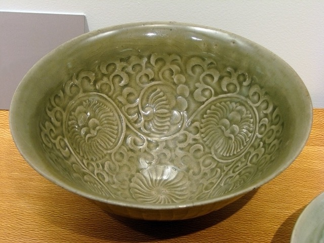
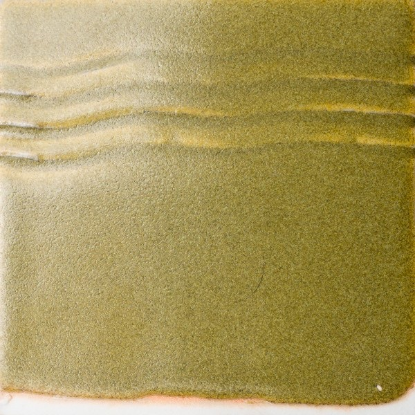
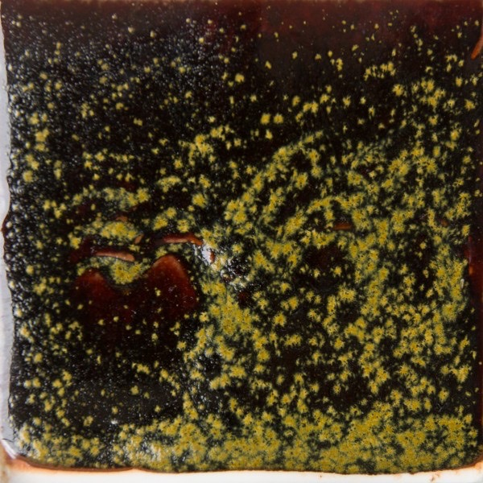
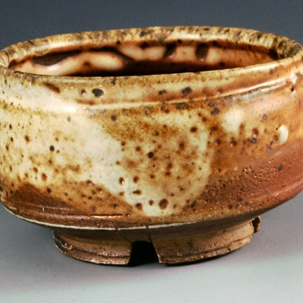
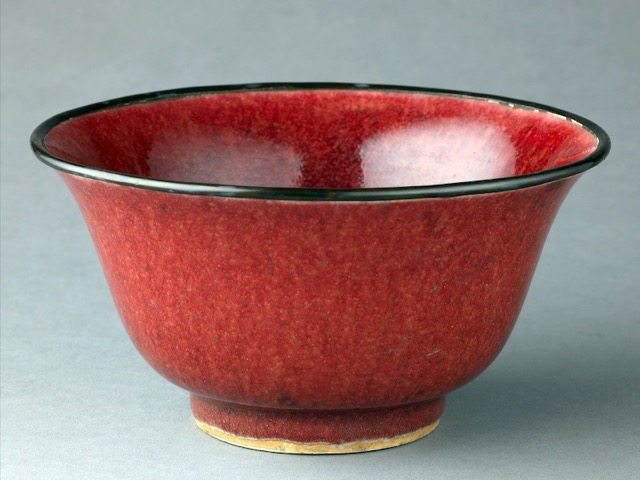
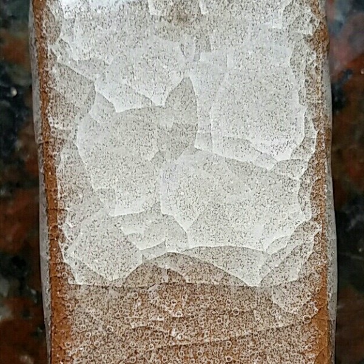

# Clay & Glaze Types

Ceramics books use numerous approaches to categorizing glazes, from color (white, black, etc.) to predominant coloring oxide (iron, cobalt, etc.) to firing temperature.

One must be careful when categorizing recipes.  If categories are too specific it becomes more difficult to search,
while very broad categories become less meaningful.

Glazy categorizes clay bodies by type and then usage, for instance: *Porcelain - Slipcasting*

For glazes, Glazy adopts the format of John Britt's
<a href="http://johnbrittpottery.com/shop/the-complete-guide-to-high-fire-glazes-glazing-firing-at-cone-10/">The Complete Guide to High-Fire Glazes, Glazing & Firing at Cone 10</a>
The categories in this book are based on a combination of glaze color, coloring oxide, surface and firing type.

## Top-level Types

* [Glazes](https://glazy.org/search?base_type=460)
* [Clay Bodies](https://glazy.org/search?base_type=110)
* [Slips and Engobes](https://glazy.org/search?base_type=400)
* [Overglazes](https://glazy.org/search?base_type=440)
* [Underglazes](https://glazy.org/search?base_type=450)
* [Refractory](https://glazy.org/search?base_type=1180)

## Clay Body Types

* [Earthenware](https://glazy.org/search?base_type=110&type=120): Low-fired clay body, often porous, may need glaze to be functional.
  * [Throwing](https://glazy.org/search?base_type=110&type=130): A type of clay optimized for wheel throwing.
  * [Slipcasting](https://glazy.org/search?base_type=110&type=140): Clay formulated for pouring into plaster molds.
  * [Sculpture](https://glazy.org/search?base_type=110&type=150): Clay designed for sculptural work.
  * [Hand-building](https://glazy.org/search?base_type=110&type=160): Clay suited for constructing pieces by hand.
  * [Salt](https://glazy.org/search?base_type=110&type=170): Special clay body used in salt glazing, where salt is introduced into the kiln to form a glassy, vitrified surface.
  * [Raku](https://glazy.org/search?base_type=110&type=180): A type of clay designed for the low-temperature Raku firing process.
* [Stoneware](https://glazy.org/search?base_type=110&type=190): High-fired clay body, hard, vitreous and strong, often used in functional ware.
  * [Throwing](https://glazy.org/search?base_type=110&type=200)
  * [Slipcasting](https://glazy.org/search?base_type=110&type=210)
  * [Sculpture](https://glazy.org/search?base_type=110&type=220)
  * [Hand-building](https://glazy.org/search?base_type=110&type=230)
  * [Salt](https://glazy.org/search?base_type=110&type=240)
  * [Raku](https://glazy.org/search?base_type=110&type=250)
* [Porcelain](https://glazy.org/search?base_type=110&type=260): Very pure, high-fired clay body, known for its whiteness and translucency.
  * [Throwing](https://glazy.org/search?base_type=110&type=270)
  * [Slipcasting](https://glazy.org/search?base_type=110&type=280)
  * [Sculpture](https://glazy.org/search?base_type=110&type=290)
  * [Hand-building](https://glazy.org/search?base_type=110&type=300)
  * [Salt](https://glazy.org/search?base_type=110&type=310)
  * [Raku](https://glazy.org/search?base_type=110&type=320)
* [Flameware](https://glazy.org/search?base_type=110&type=330): Clay body formulated to withstand direct flame, used for cookware.
  * [Throwing](https://glazy.org/search?base_type=110&type=340)
  * [Slipcasting](https://glazy.org/search?base_type=110&type=350)
  * [Sculpture](https://glazy.org/search?base_type=110&type=360)
  * [Hand-building](https://glazy.org/search?base_type=110&type=370)
  * [Salt](https://glazy.org/search?base_type=110&type=380)
  * [Raku](https://glazy.org/search?base_type=110&type=390)

## Slips & Engobe Types
* [Slip](https://glazy.org/search?base_type=400&type=410): Liquid clay used for decoration or bonding clay pieces together.
* [Engobe](https://glazy.org/search?base_type=400&type=420): A slip that is layered on ware, usually colored & vitreous after firing. Similar to a mix of glaze and slip.
* [Terra Sigillata](https://glazy.org/search?base_type=400&type=430): A refined slip made of very fine particles used to create a soft, satin surface finish.

## Glaze Sub-Types

### [Clear](https://glazy.org/search?base_type=460&type=470)

Transparent glaze, often used to highlight underlying clay or decoration.

Clear glazes are a type of "Base Glaze".  They don't have any colorants or opacifiers.  They are usually Glossy, but can also have a Satin finish.

Clear glazes are located in the middle "Bright" region of the Stull Chart.
When too much Alumina or Silica is added to a Clear glaze, then it often changes to a Matte Glaze.

In the Silica:Alumina Stull Chart above, you can see that most Clear glazes fall within the middle "Bright" region.

### [White, Off-White](https://glazy.org/search?base_type=460&type=480)

Glazes with varying shades of white.  Usually don't contain additives like colorants, but may include opacifiers like Tin & Zircopax.

### [Iron](https://glazy.org/search?base_type=460&type=490)

Glazes rich in iron oxide, producing colors ranging from blue, green, yellow, amber, brown, and black.

#### [Celadon](https://glazy.org/search?base_type=460&type=500)

Pale, translucent green glaze, traditionally used in Chinese ceramics.

[Wikipedia: Celadon](https://en.wikipedia.org/wiki/Celadon)

##### [Blue](https://glazy.org/search?base_type=460&type=510)

Especially high-purity celadons with low titania and iron that have a blue tint.

*Typical blue celadon glaze.*

*Ancient Ru-type Chinese celadon.*

##### [Green](https://glazy.org/search?base_type=460&type=520)

Green celadons typically include more iron oxide (about 1-2%) than blue celadons, and may contain color modifiers or impurities like titania.

*[Typical green celadon glaze.](https://glazy.org/recipes/6352)*

*Ancient Chinese Yaozhou kiln celadon.*

##### [Yellow](https://glazy.org/search?base_type=460&type=530)

Yellow-tinted celadons produced by particular glaze chemistries or firing in oxidation atmosphere.

*[David Leach Yellow Celadon](https://glazy.org/recipes/3453)*

*[Oxidation yellow celadon](https://glazy.org/recipes/95303)*

##### [Chun/Jun](https://glazy.org/search?base_type=460&type=533)

A type of traditonal Chinese high-fire blue glaze, often with opalescent quality.

*[Wikipedia: Jun ware](https://en.wikipedia.org/wiki/Jun_ware)*

*[Nigel Wood Jun](https://glazy.org/recipes/2927)*

##### [Amber](https://glazy.org/search?base_type=460&type=535)

A warm, golden-brown glaze.  Often has about 4% iron oxide.

##### [Tenmoku](https://glazy.org/search?base_type=460&type=540)

Dark brown to black glaze, often with a glossy finish.  Contains high iron amounts of around 8%.

*Jian tea bowl with "hare's fur" glaze, southern Song dynasty, 12th century, Metropolitan Museum of Art.*

[Wikipedia: Jian ware](https://en.wikipedia.org/wiki/Jian_ware)

[Wikipedia: Tenmoku](https://en.wikipedia.org/wiki/Tenmoku)

*[Song Dynasty Inspired Tianmu/Tenmoku Glaze](https://glazy.org/recipes/22939)*

##### [Tea Dust](https://glazy.org/search?base_type=460&type=550)

Traditional Chinese glaze with speckled crystals.

*Chinese Tea Dust glazed vase, via Sotheby's*

*Various shades of teadust glazes on Chinese antiques.*

*[Coleman Tea Dust Black](https://glazy.org/recipes/3308)*

##### [Hare's Fur](https://glazy.org/search?base_type=460&type=560)

Traditional Chinese glaze with streaked effect, resembling a hare's fur.

*View of the "hare's fur" glazing effect on a Jian bowl [Wikipedia: Jian ware](https://en.wikipedia.org/wiki/Jian_ware)*

##### [Kaki, Tomato Red](https://glazy.org/search?base_type=460&type=570)

Iron-saturate glazes with large amounts of iron (often over 10%) that develop a red, crystalline surface.

*[Kaki Biaxial D4](https://glazy.org/recipes/25001)*

##### [Oil Spot](https://glazy.org/search?base_type=460&type=580)

Traditional Chinese iron glaze with dark background and lighter "spots" that resemble oil spots.

*[Wikipedia: Jian ware](https://en.wikipedia.org/wiki/Jian_ware)*

*[John's Oil Spot #3](https://glazy.org/recipes/541), by John Britt*

##### [Slip-Based](https://glazy.org/search?base_type=460&type=585)

Glazes formulated with high iron content clays like Albany, Alberta, and Redart.

*[Andies Handful of Earth](https://glazy.org/recipes/5211), image by Hette Hillsdon.*

### [Shino](https://glazy.org/search?base_type=460&type=590)

Traditional Japanese high-feldspar/high-alkali, opaque, fatty glaze.

*Shino ware tea bowl furisode, Azuchi-Momoyama to Edo period, 16th-17th century [Wikipedia: Shino ware](https://en.wikipedia.org/wiki/Shino_ware)*

##### [Traditional](https://glazy.org/search?base_type=460&type=600)

Glazes formulated with historical or classic techniques and materials.

##### [Carbon Trap](https://glazy.org/search?base_type=460&type=610)

A Shino that traps carbon during firing, creating various surface effects & colors.

*[Gustin Shino](https://glazy.org/recipes/2971) via John Britt.*

##### [High-Alumina](https://glazy.org/search?base_type=460&type=620)

High-alumina Shinos.

*[Mino Shino](https://glazy.org/recipes/2991) via John Britt*

##### [White](https://glazy.org/search?base_type=460&type=630)

White Shinos.

### [Red](https://glazy.org/search?base_type=460&type=635)

Red-colored glazes developed via a number of mechanisms.

#### [Copper](https://glazy.org/search?base_type=460&type=640)

Glazes that obtain their red color through the effect of copper.

##### [Oxblood](https://glazy.org/search?base_type=460&type=650)

Sub-type of traditional Chinese copper-red glaze.

[Wikipedia: Sang de boeuf glaze](https://en.wikipedia.org/wiki/Sang_de_boeuf_glaze)

*[Pete's Red](https://glazy.org/recipes/17547) via Sid Henderson*

##### [Flambe](https://glazy.org/search?base_type=460&type=660)

Sub-type of traditional Chinese copper-red glaze.

*[Flambe-glazed Three-handled Vase, Qianlong](https://glazy.org/search?base_type=460&type=670) via Christie's*

##### [Peach Bloom](https://glazy.org/search?base_type=460&type=670)

Sub-type of traditional Chinese copper-red glaze.

*[Qing Dynasty Water pot](https://www.metmuseum.org/art/collection/search/460689)*

#### [Pink](https://glazy.org/search?base_type=460&type=673)

Pink glazes are often created using small amounts of Chrome or by using stains.

*[20ish x5 Pink](https://glazy.org/recipes/39156) via Andy Taylor.*

#### [Stain](https://glazy.org/search?base_type=460&type=675)

Glazes using commercial ceramic stains for red color.

### [Green](https://glazy.org/search?base_type=460&type=680)

Green glazes developed via a number of mechanisms.

#### [Copper](https://glazy.org/search?base_type=460&type=690)

#### [Oribe](https://glazy.org/search?base_type=460&type=700)

Green is the typical colour of Oribe ware, along with white. The original Chinese green was a smooth, even colour like celadon. Oribe, however, tried to use different shades of more natural green, in order to reflect green mountains or riverside scenes. For the brilliant green color, wares are fired using oxidation at 1220 degrees Celsius.

[Wikipedia: Oribe ware](https://en.wikipedia.org/wiki/Oribe_ware)

*[An Oribe Bottle](https://www.christies.com/lot/lot-4004174) via Christie's.*

#### [Chrome](https://glazy.org/search?base_type=460&type=710)

Green glazes can be obtained with small amounts of chrome (1% or less).

*[Rivulet Green](https://glazy.org/recipes/361011) via Matt Kelleher*

#### [Titanium](https://glazy.org/search?base_type=460&type=720)

Titania often acts as a color modifier, turning celadons with iron green, working with copper for beautiful greens, even turning cobalt a shade of green.

*[Vert CoTi](https://glazy.org/recipes/53570) via Jean-Pierre Prieto showing cobalt and titania producing green.*

*[Чунь №1](https://glazy.org/recipes/257554) via Alexandra Shcherbakova showing copper and titania greens.*

#### [Nickel](https://glazy.org/search?base_type=460&type=730)

#### [Stain](https://glazy.org/search?base_type=460&type=740)

### [Turquoise](https://glazy.org/search?base_type=460&type=745)

### [Blue](https://glazy.org/search?base_type=460&type=750)

#### [Cobalt](https://glazy.org/search?base_type=460&type=760)

Cobalt can be added in small increments of 0.1% to 1% to obtain blue glazes.

*Line blend adding Cobalt Oxide* 

*Showing the effects of different fluxes on glazes with cobalt.*

#### [Rutile](https://glazy.org/search?base_type=460&type=770)

Either alone or in combination with cobalt, rutile can produce the "floating blue" effect.

*[Bleu de rutile](https://glazy.org/recipes/68393) via Jean-Pierre Prieto showing rutile producing a floating blue.*

*[Floating Blue](https://glazy.org/recipes/10684) via Joe Thompson combining rutile with cobalt.*

#### [Barium](https://glazy.org/search?base_type=460&type=780)

In combination with cobalt, barium can produce vivid, intense blues.

*[Intense Blue](https://glazy.org/recipes/28378) via erik ragni*

#### [Strontium](https://glazy.org/search?base_type=460&type=790)

*[Strontium Blue](https://glazy.org/recipes/43015) via chance taylor*

#### [Nickel](https://glazy.org/search?base_type=460&type=800)

*[Lively Lavender](https://glazy.org/recipes/39794) via Alexander Kuttel using nickel with cobalt*

*[Nickel blue strontium matte](https://glazy.org/recipes/57568) via Jeannine Vrins using only nickel*

#### [Stain](https://glazy.org/search?base_type=460&type=810)

Various blue stains can be added to a base glaze to produce blue.

### [Purple](https://glazy.org/search?base_type=460&type=820)

#### [Magnesium](https://glazy.org/search?base_type=460&type=830)

#### [Nickel](https://glazy.org/search?base_type=460&type=840)

#### [Manganese](https://glazy.org/search?base_type=460&type=850)

### [Matte](https://glazy.org/search?base_type=460&type=860)

#### [Magnesium Matte](https://glazy.org/search?base_type=460&type=870)

### [Black](https://glazy.org/search?base_type=460&type=880)

#### [Slip-Based](https://glazy.org/search?base_type=460&type=890)

#### [Glossy](https://glazy.org/search?base_type=460&type=900)

#### [Satin](https://glazy.org/search?base_type=460&type=910)

### [Yellow](https://glazy.org/search?base_type=460&type=920)

#### [Iron](https://glazy.org/search?base_type=460&type=930)

#### [Barium](https://glazy.org/search?base_type=460&type=940)

#### [Manganese](https://glazy.org/search?base_type=460&type=950)

#### [Stain](https://glazy.org/search?base_type=460&type=960)

#### [Nickel](https://glazy.org/search?base_type=460&type=970)

### [Crystalline](https://glazy.org/search?base_type=460&type=980)

Glazes that develop visible crystals during cooling.

#### [Micro](https://glazy.org/search?base_type=460&type=990)

#### [Aventurine](https://glazy.org/search?base_type=460&type=1000)

#### [Manganese](https://glazy.org/search?base_type=460&type=1010)

#### [Macro](https://glazy.org/search?base_type=460&type=1020)

### [Single-Fire](https://glazy.org/search?base_type=460&type=1030)

Glazes applied to greenware, fired in a single step.

### [Wood](https://glazy.org/search?base_type=460&type=1040)

Glazes specifically developed for wood firing, often displaying atmospheric surface effects.

### [Salt & Soda](https://glazy.org/search?base_type=460&type=1050)

### [Raku](https://glazy.org/search?base_type=460&type=1055)

Special glazes used in the low-temperature Raku firing process.

### [Ash](https://glazy.org/search?base_type=460&type=1060)

Glazes containing or imitating wood ash, often with earthy qualities, often traditional.

#### [Nuka](https://glazy.org/search?base_type=460&type=1070)

Traditional Japanese rice-husk ash glaze.

#### [Synthetic/Fake](https://glazy.org/search?base_type=460&type=1080)

Glazes that use modern glaze materials to emulate the chemistry of ashes.

#### [Slip-Based](https://glazy.org/search?base_type=460&type=1090)

### [Majolica](https://glazy.org/search?base_type=460&type=1100)

Traditional opaque tin glaze, often used as a ground for overglaze decoration.

[Wikipedia: Majolica](https://en.wikipedia.org/wiki/Majolica)
[Wikipedia: Maiolica](https://en.wikipedia.org/wiki/Maiolica)

*Polychrome majolica dish with paintings of a fish, flowers, and fruit. Lodi, Italy, 1751. [Wikipedia: Maiolica](https://en.wikipedia.org/wiki/Maiolica)*

*[San Diego State U Majolica (modified)](https://glazy.org/recipes/153552) via David Sackett.*

### [Bristol](https://glazy.org/search?base_type=460&type=1110)

A glaze that relies on the fluxing action of Zinc Oxide for fully melting, even at lower temperatures without the need for boron.

*[Bristol glaze base](https://glazy.org/recipes/69994) via Eric P.*

### [Specialty](https://glazy.org/search?base_type=460&type=1130)

#### [Crackle](https://glazy.org/search?base_type=460&type=1140)

*[Snowflake Crackle #8](https://glazy.org/recipes/7052) via Clara Giorello*

#### [Crawling](https://glazy.org/search?base_type=460&type=1150)

Glazes that pull away from the clay body during firing, creating a crawling effect.

*[Brain Coral Crawl / Lichen Crawl](https://glazy.org/recipes/27803) via Jake Glaze*

#### [Gloop](https://glazy.org/search?base_type=460&type=1155)

A glaze that sits between glaze and clay, with drips.

*[Gloop Biaxial with B2O3 0.3](https://glazy.org/recipes/59365)*

#### [Crater](https://glazy.org/search?base_type=460&type=1160)

Glazes that form craters or pits on the surface.

*[Akiko's crater glaze](https://glazy.org/recipes/4454) via kenneth ibbett*

#### [Metallic](https://glazy.org/search?base_type=460&type=1170)

Glazes with metallic sheen, often through the use of high amounts of colorants/additives like manganese.

*[Gold](https://glazy.org/recipes/198013) via Kim Ulrick*