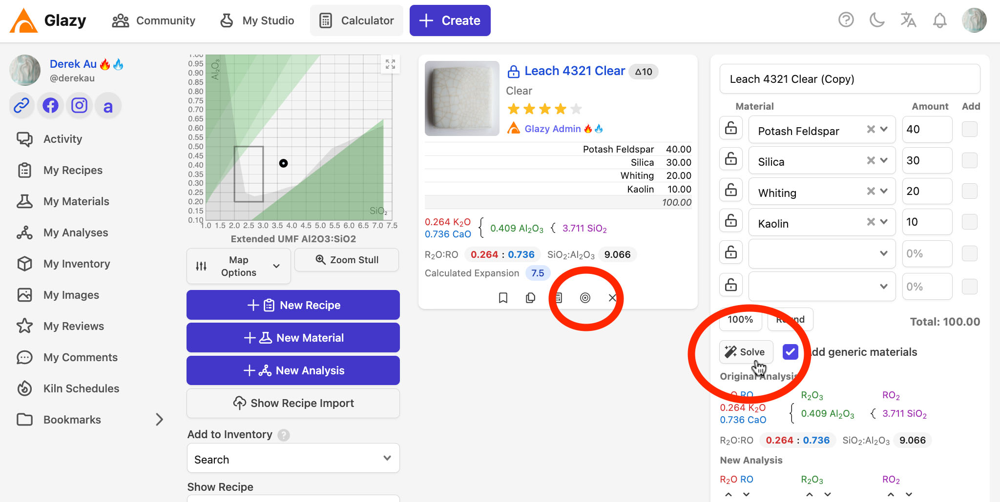
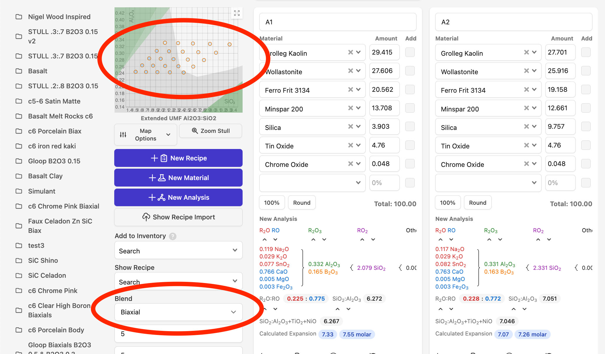
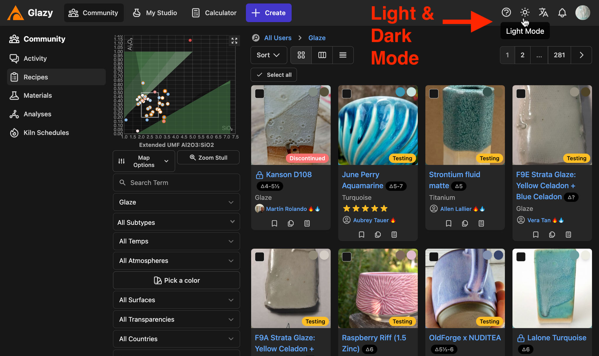
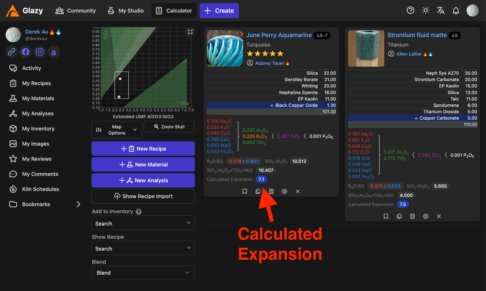
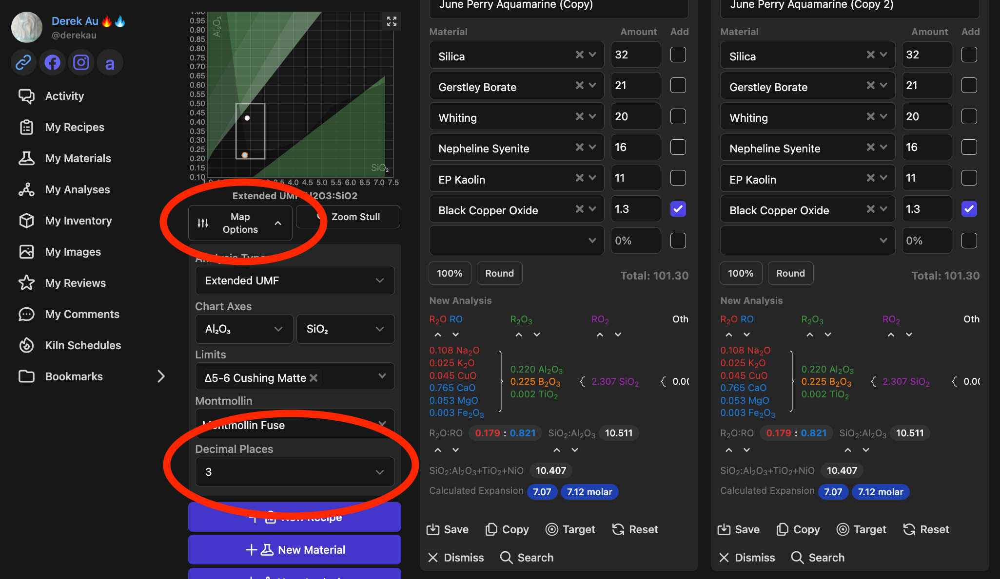
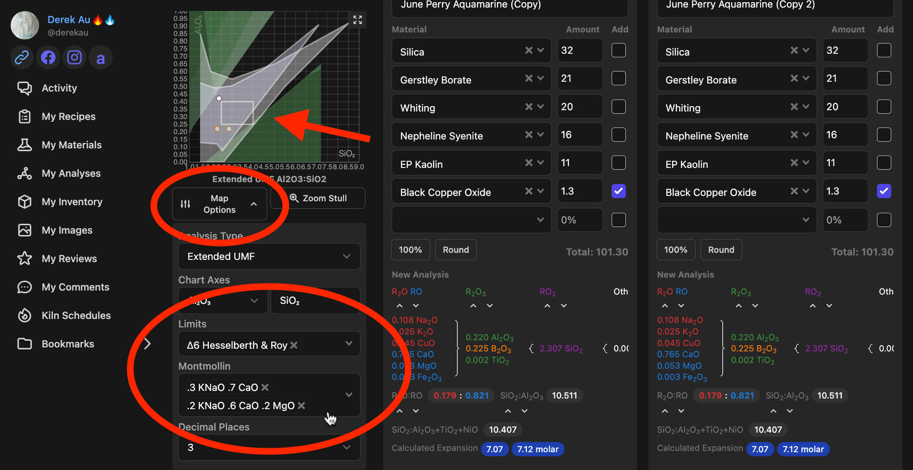
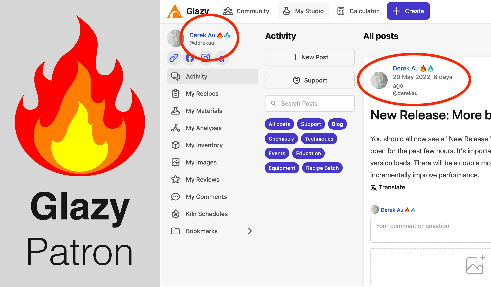
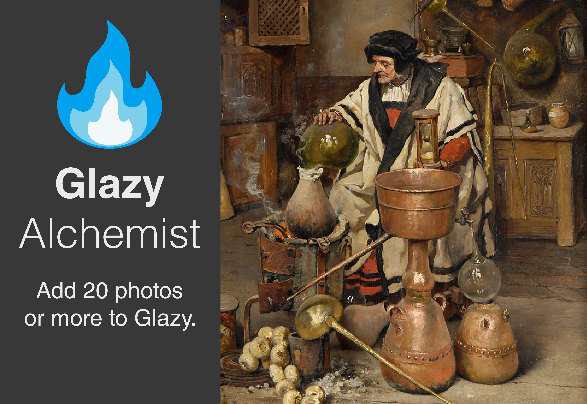
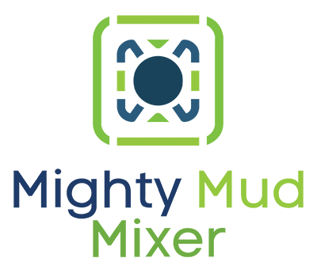

# Support Glazy

## Why Support Glazy?

Glazy is 100% free for use by anyone.

Glazy doesn't spy on you, sell your information to third parties, or otherwise profit on you in any way.

Glazy is the only online glaze calculation software that promotes sharing recipes and test results so that potters can learn more about ceramic chemistry while verifying and improving results.

## How to Support Glazy

The best way to support Glazy is to use it! Uploading images of glazes, verifying existing recipes, and sharing your own recipes helps Glazy become a more trustworthy source of ceramics information.

**Glazy will always remain open and free.** But the Glazy code takes many hours each month to write and maintain, as does providing support to users, creating tests, and importing new data into the database. The web servers that Glazy runs on cost more as Glazy grows. Therefore I am adding some features that are "Patron-only", enabled only for those who financially contribute. Those who contribute help to support the thousands of teachers, students, and all those unable to contribute.

### Free for Student & Teachers

If you are currently a student or teacher in Ceramics or a related Visual Arts department, simply register with a .edu email address and you will automatically be given 12 months of Patron status for free. If your school doesn't use the .edu domain, just send a photo of your Student ID or other proof of enrollment to **derek [at] glazy [dot] org**.

### Become a Patron Now!

[Click this link to become a Glazy Patreon patron.](https://www.patreon.com/join/derekau)

## Glazy Patron Special Features

Those who pledge $2 per month receive a special "flame" badge that appears next to their username in Glazy. Whether you donate $100 or $2 a month, every patron gets the same badge. This badge unlocks some special Glazy features.

### Target & Solve

Just open a Recipe, Material, or Analysis in the Calculator and click the "Target" button. In the new recipe, add materials you would like to use to reformulate the target analysis, then click "Solve". Glazy will automatically calculate the new recipe for you!

**_[Learn more about Target & Solve here.](/guide/targetsolve)_**

### Blends

Patrons can easily make Line, Triaxial and Biaxial blends between 2-4 recipes.

### Dark Mode

By clicking the "Dark Mode" button, you can easily switch between light and dark versions of Glazy.

### Calculated Thermal Expansion

For Patrons, Calculated Thermal Expansion is shown in the search, recipe, and calculator.

### Decimal Places

Patrons can adjust the number of decimal places they use in the Calculator. This can be very handy when working with exact substitutions in UMF.

### Limits

Various glaze limits can be layered on top of the Glazy Calculator Chart.

### Patron Badge

Patrons receive the "Patron" badge next to their name in Glazy.

### Alchemist Badge

In order to show appreciation for ALL contributors, the Alchemist badge was added. This badge is shown when a user has uploaded 20 or more photos to Glazy. Photos are essential to understanding what a recipe looks like, as well as to compare differences between materials, preparation, and firing types.

## Patreon Sponsors

The top level of Patreon sponsorship is the Patron level at $100 USD/mo.

Benefits of this level are having your company, school, or organization's logo displayed on the Glazy website footer as well as in this section of the Glazy Help site.

### [Might Mud Mixer](https://mightymudmixer.com/)

Found a beautiful glaze on Glazy but don't have the materials or space to mix the recipe yourself?
Might Mud Mixer will mix up the glaze and ship it to you! Or you can order one of Mighty Mud Mixer's
beatiful, tested, and reliable glaze recipes. Just visit <a href="https://mightymudmixer.com/">https://mightymudmixer.com</a> today!

### [Gasworks NYC](https://gasworksnyc.com)

In addition to their exciting lineup of classes, workshops, and other events, Gasworks NYC has been releasing a steady stream of beautiful ceramics tests on their Instagram account. They've also released a number of studio glazes on their Glazy page, https://glazy.org/u/gasworksnyc
