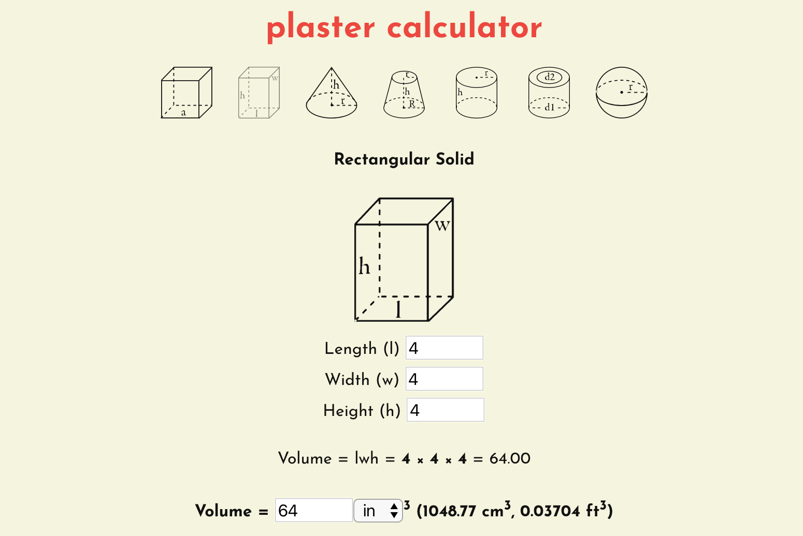

# Tools

## Glazy Wiki

The Discourse Wiki on our own secure server.

[https://wiki.glazy.org](https://wiki.glazy.org)

## Plaster Calculator

[https://plaster.glazy.org/](https://plaster.glazy.org/)

## Lipgloss

Pieter's Lipgloss, a python app for calculating recipes from UMF analyses. Currently still in development. The source code can be found [here](https://github.com/PieterMostert/Lipgloss).

Version 2, which is faster and (hopefully) easier to install, can be found [here](https://github.com/PieterMostert/LIPGLOSS2).

## Currie Grid Calculator

Tom's Currie Grid calculator:

[http://demeranville.com/pottery/curriecalc.html](http://demeranville.com/pottery/curriecalc.html)

## Glaze Formulator

Dan Lizotte's Glaze Formulator, a web application built using R for creating recipes from UMF analyses:

[https://glaze.warewolves.ca/](https://glaze.warewolves.ca/)

## U.M.F calculator

Matthew Katz's U.M.F calculator for Excel

[http://www.ceramicmaterialsworkshop.com/umf-calculator.html](http://www.ceramicmaterialsworkshop.com/umf-calculator.html)

## Specific Gravity Calculator

Jason Bruce's Specific Gravity calculator

[https://jbruce12000.github.io/glaze-specific-gravity-calculator/html/specific-gravity.html](https://jbruce12000.github.io/glaze-specific-gravity-calculator/html/specific-gravity.html)

[https://github.com/jbruce12000/glaze-specific-gravity-calculator](https://github.com/jbruce12000/glaze-specific-gravity-calculator)

## Ceramics Dictionary

https://docs.google.com/…/1WVEwkShTHL9KsmFClMqaqJFl63…/edit…
[https://docs.google.com/spreadsheets/d/1WVEwkShTHL9KsmFClMqaqJFl63WZ_20fLo2OF80Nw_8/edit](https://docs.google.com/spreadsheets/d/1WVEwkShTHL9KsmFClMqaqJFl63WZ_20fLo2OF80Nw_8/edit)

## UMF Charts

[https://derekphilipau.github.io/vue-d3-stull-charts/](https://derekphilipau.github.io/vue-d3-stull-charts/)

## Ceramic Chemistry Visualization

Various types of web visualizations for ceramics. Includes Javascript Stull Charts.

[https://derekphilipau.github.io/ceramic-chemistry-visualization/](https://derekphilipau.github.io/ceramic-chemistry-visualization/)

## GlazeMaster 3

GlazeMaster 3 Downloads (now free, including FileMaker source)

[http://www.masteringglazes.com/glazemaster/downloads.html](http://www.masteringglazes.com/glazemaster/downloads.html)

## Ceramics Web Search

Some other good resources to search for ceramics info:

<a href="http://community.ceramicartsdaily.org">Ceramic Arts Daily Forums</a>,
<a href="http://archives.clayartarchives.com/">Clayart Archives (1996-2008)</a>,
<a href="http://potters.org">Clayart Archives (?-2012)</a>,
<a href="https://lists.clayartworld.com/pipermail/clayart/">Clayart Archives (2014-Present)</a>,
<a href="http://digitalfire.com">Digitalfire</a>,
<a href="http://cone6pots.ning.com/">Electric Cone 6 & Other Ways w/ Clay</a>
